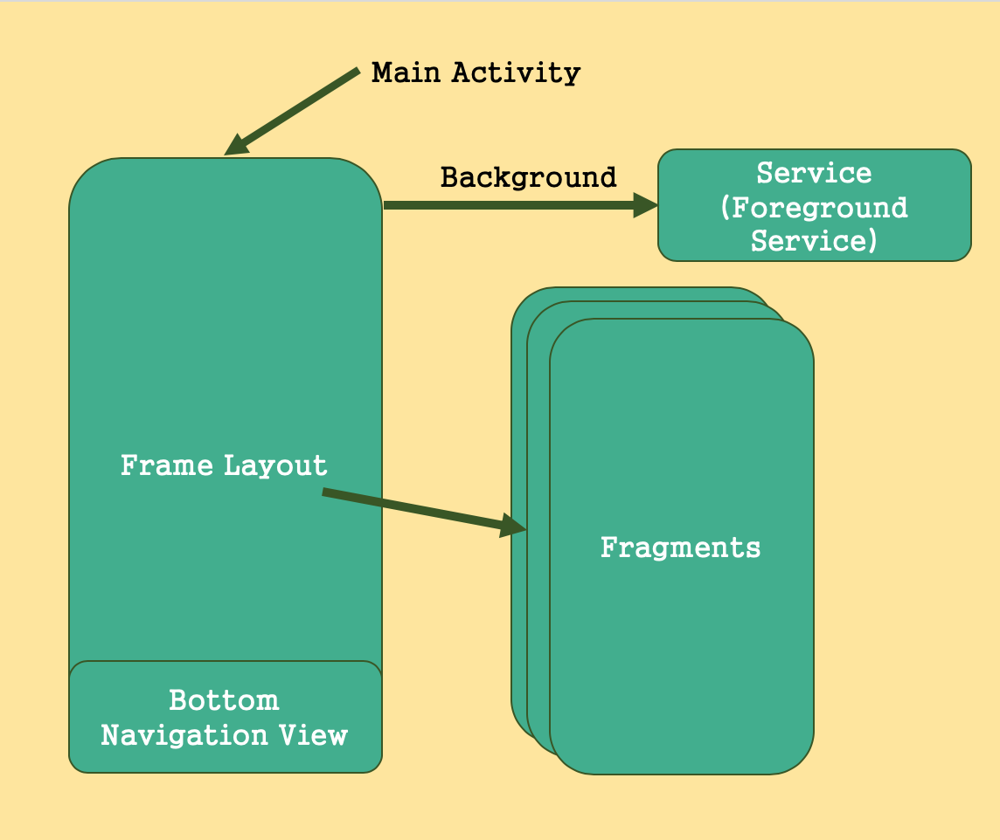
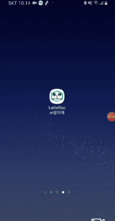
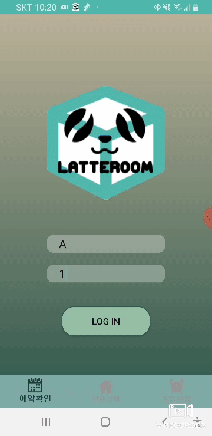
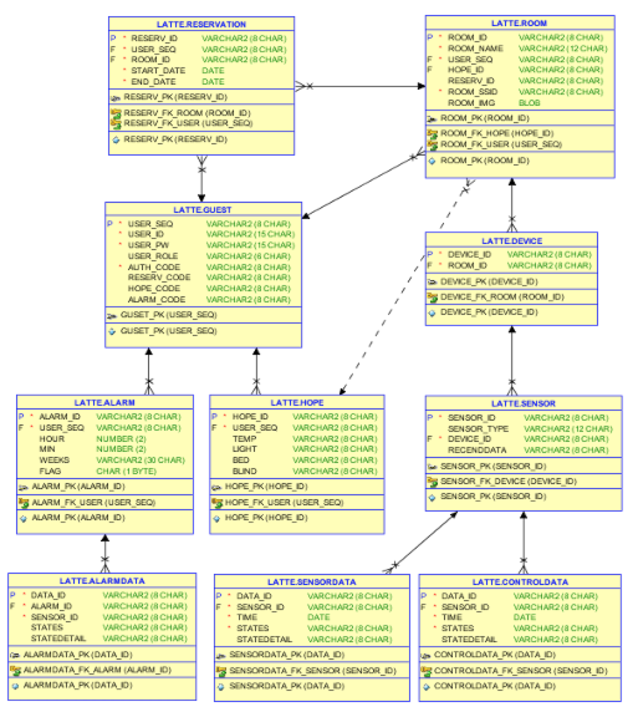

LatteFinalNoShared


## 구조





### Main Activity([code](https://github.com/Hae-gun/LatteFinalNoShared/blob/master/app/src/main/java/org/techtown/lattefinalnoshared/MainActivity.java))

* Frame Layout
  * Fragment 화면에 출력 (Bottom Navigation에 의해 제어됨)
* Bottom Navigation View
  * Fragment 화면 제어.
  * Login 성공시에만 제어가능.
* onBackPressed 메서드를 이용한 화면 제어.
  * 이전 Fragment 화면으로 이동.

### Service([code](https://github.com/Hae-gun/LatteFinalNoShared/blob/master/app/src/main/java/org/techtown/lattefinalnoshared/TCPIPConnectionService.java))

* 소켓통신 ( Socket Network ; TCP/IP )
  * 모든 Activity 와 Fragment 에서 서버에 보낼 데이터를 받아 Server에 전달.
  * 전송시 정의한 Message 객체를 JSON 문자열로 변환하여 전송.
* Foreground Service
  * Foreground Service 를 이용한 immortal Service 구현.
  * Oreo 버전 이후부터 Foreground Service 사용을 위해 Notification 설정 필수.

### Fragments

* 각 Fragment 가 화면에 표시될 때 서비스로 request 메세지를 전송.
* 서비스에서 Socket 통신을 통해 JSON 문자열을 받음.
* 받은 JSON 문자열을 Gson 을 이용하여 LatteMessage 로 객체화.
* 필요 데이터들을 각 Fragment Component에 설정.

#### Login([code](https://github.com/Hae-gun/LatteFinalNoShared/blob/master/app/src/main/java/org/techtown/lattefinalnoshared/fragments/Login.java))

* userId, password 를 입력받아 서비스로 데이터 전달.

* 로그인 실패시 Toast Messgae 출력

  


#### RoomList([code](https://github.com/Hae-gun/LatteFinalNoShared/blob/master/app/src/main/java/org/techtown/lattefinalnoshared/fragments/RoomList.java))

* Server 에 유저 정보에 대한 방 정보를 요청
* RecyclerView 를 이용하여 Server 로부터 받은 데이터 출력. (Adapter 이용 - MVP Pattern)
* Glide 를 이용한 image 표현.
* 받아온 날짜 정보를 이용하여 기간 연산.



#### RoomCurrentSetting([code](https://github.com/Hae-gun/LatteFinalNoShared/blob/master/app/src/main/java/org/techtown/lattefinalnoshared/fragments/RoomCurrentSetting.java))

* Server 에 현재 사용가능한 방 정보 요청.
* Server 로 부터 받은 데이터를 각  TextView에 설정.
* SeekBar 이용하여 희망온도, 전구 밝기값을 숫자로 받아 서버로 바로 전송.
* Toggle Button 을 이용하여 전구를 On/Off 지정한다.


#### AlarmSetting([code](https://github.com/Hae-gun/LatteFinalNoShared/blob/master/app/src/main/java/org/techtown/lattefinalnoshared/fragments/AlarmSetting.java))

* Server에서 현재 유저이름으로 저장된 알람정보를 받아온다.
* 받아온 정보를 분석하여 저장된 시간과 요일을 체크하여 컴포넌트의 상태를 변경한다.
* 새로 알람을 지정하여 저장 버튼 터치시 서버로 해당 정보를 JSON 문자열로 전송한다.


## 데이터 교환

### Broadcast Receiver 사용

* 통신 방식
  1. Service, Activity, Fragment 각각 Broadcast Receiver 객체를 갖음.
  2. LocalBroadcastManager 의 static 매서드를 이용.
  3. Service 에서 Server를 통해 받은 JSON 데이터를 메세지(LatteMessage) 객체로 Parsing.
  4. 객체의 프로토콜을 분석하여 해당 객체가 사용되는 Fragment에 전송.
  5. 전송시 Intent에 값을 JSON String 으로 주입시킨다.
  
* Ex)

  ```java
  // BroadcastReceiver 정의.
  getDataReceiver = new BroadcastReceiver() {
           @Override
           public void onReceive(Context context, Intent intent) 			{
               // 가져온 Intent에서 값 받을때.
               String data ="";
               if((data=intent.getStringExtra("key값"))!=null){
                   // .... 해당부분에 로직 구현 
               }
            }
      };
  
  // BroadcastReceiver 등록.
  LocalBroadcastManager.getInstance(this)
      .registerReceiver(getDataReceiver, new IntentFilter("name"));
  // 다른 Activity or Fragment or Service 등에서 "name" 으로 Intent를 보내주면 해당블록으로 도달함.
  
  // 보낼때.
  Intent intent = new Intent("지정한 이름");
  intent.putExtra(key값,value값);
  
  LocalBroadcastManager.getInstance(
      (MainActivity) getActivity()).sendBroadcast(intent);
  ```

  

## Message

* LatteMessage 구조

  * 큰 Json 문자열(LatteMessage ) 안에 Json 문자열(jsonData)을 객체로 갖고 있는 형태이다.
  * 약속한 Protocol 에 따라 code1 값을 분석한 후 그에 따른 VO객체를 jsonData 에 주입시킴.

  ```java
  public class LatteMessage {
  
      private String clientNo;
      private String roomNo;
      private String code1;
      private String code2;
      private String jsonData;
  	
    // 이하 생략
  }
  ```

  

  

## VO



* [Alarm](https://github.com/Hae-gun/LatteFinalNoShared/blob/master/app/src/main/java/org/techtown/lattefinalnoshared/VO/Alarm.java)
* [AlarmData](https://github.com/Hae-gun/LatteFinalNoShared/blob/master/app/src/main/java/org/techtown/lattefinalnoshared/VO/AlarmData.java)
* [Guest](https://github.com/Hae-gun/LatteFinalNoShared/blob/master/app/src/main/java/org/techtown/lattefinalnoshared/VO/Guest.java)
* [Hope](https://github.com/Hae-gun/LatteFinalNoShared/blob/master/app/src/main/java/org/techtown/lattefinalnoshared/VO/Hope.java)
* [LatteMessage](https://github.com/Hae-gun/LatteFinalNoShared/blob/master/app/src/main/java/org/techtown/lattefinalnoshared/VO/LatteMessage.java)
* [Message](https://github.com/Hae-gun/LatteFinalNoShared/blob/master/app/src/main/java/org/techtown/lattefinalnoshared/VO/Message.java)
* [Reservation](https://github.com/Hae-gun/LatteFinalNoShared/blob/master/app/src/main/java/org/techtown/lattefinalnoshared/VO/LatteMessage.java)
* [Room](https://github.com/Hae-gun/LatteFinalNoShared/blob/master/app/src/main/java/org/techtown/lattefinalnoshared/VO/Room.java)
* [RoomDetail](https://github.com/Hae-gun/LatteFinalNoShared/blob/master/app/src/main/java/org/techtown/lattefinalnoshared/VO/RoomDetail.java)
* [RoomListData](https://github.com/Hae-gun/LatteFinalNoShared/blob/master/app/src/main/java/org/techtown/lattefinalnoshared/VO/LatteMessage.java)
* [Sensor](https://github.com/Hae-gun/LatteFinalNoShared/blob/master/app/src/main/java/org/techtown/lattefinalnoshared/VO/Sensor.java)
* [SensorData](https://github.com/Hae-gun/LatteFinalNoShared/blob/master/app/src/main/java/org/techtown/lattefinalnoshared/VO/SensorData.java)
* [SingletoneVO](https://github.com/Hae-gun/LatteFinalNoShared/blob/master/app/src/main/java/org/techtown/lattefinalnoshared/VO/SingletoneVO.java)
* [UserVO](https://github.com/Hae-gun/LatteFinalNoShared/blob/master/app/src/main/java/org/techtown/lattefinalnoshared/VO/UserVO.java)

## Protocol

* Device
  * 접속
    * 요청 : Message [ deviceNo, CONNECT, null, null ] 
    * 응답 (승인) : Message [ deviceNo, CONNECT, SUCCESS, null ]
    * 응답 (미승인) : Message [ deviceNo, CONNECT, FAIL, null ]
  * 상태변경
    * 요청 : Message [ deviceNo, UPDATE, TYPE, SensorData ] 
    * 응답 (승인) : Message [ roomNo, UPDATE, TYPE, Sensor ]
    * 응답(실패) : Message [ deciceNo, UPDATE, TYPE, FAIL ]
* Android
  * 로그인
    * 요청 : Message [ null, LOGIN, null, null ]
    * 응답(승인) : Message [ guestNo, LOGIN, SUCCESS, Guest ]
    * 응답(미승인) : Message [ null, LOGIN, FAIL, null ]
  * 재접속
    * 요청 : Message [ guestNo, RECONN, null, null ]
    * 응답(성공) : Message [ guestNo, RECONN, SUCCESS, null ]
    * 응답(실패) : Message [ guestNo, RECONN, FAIL, null ]
  * 예약정보 조회
    * 요청 : Message [ guestNo, RESERVLIST, null, null ]
    * 응답(승인) : Message [ guestNo, RESERVLIST, COUNT, Reservation ]
    * 응답(미승인) : Message [ null, RESERVLIST, FAIL, null ]
  * 객실상태 조회
    * 요청 : Message [ guestNo, ROOMDETAIL, null, Room ]
    * 응답(승인) : Message [ guestNo, ROOMDETAIL, SUCCESS, RoomDetail ]
    * 응답(미승인) : Message [ null, ROOMDETAIL, FAIL, null ]
  * 장치제어 요청
    * 요청 : Message [ roomNo, CONTROL, TYPE, SensorData ]
    * 응답(성공) : Message [ deviceNo, CONTROL, TYPE, SensorData ]
    * 응답(실패) : Message [ null, CONTROL, TYPE, FAIL ]
  * 알람 조회
    * 요청 : Message [ guestNo, ALARM, GET, null ]
    * 응답(승인) : Message [ guestNo, ALARM, GET, Alarm ]
    * 응답(미승인) : Message [ null, ALARM, GET, FAIL ]
  * 알람 수정
    * 요청 : Message [ guestNo, ALARM, UPDATE, Alarm ]
    * 응답(승인) : Message [ guestNo, ALARM, UPDATE, Alarm ]
    * 응답(미승인) : Message [ null, ALARM, UPDATE, FAIL ]
  * 알람 행동 조회
    * 요청 : Message [ guestNo, ALARMJOB, GET, null ]
    * 응답(승인) : Message [ guestNo, ALARMJOB, GET, null ]
    * 응답(미승인) : Message [ null, ALARMJOB, GET, FAIL ]
  * 알람 행동 수정
    * 요청 : Message [ guestNo, ALARMJOB, UPDATE, AlarmData ]
    * 응답(승인) : Message [ guestNo, ALARMJOB, UPDATE, AlarmData ]
    * 응답(미승인) : Message [ null, ALARMJOB, UPDATE, FAIL ]

## Library

* [Gson](https://sites.google.com/site/gson/gson-user-guide) - Json 변환 라이브러리.
* [Glide](https://bumptech.github.io/glide/doc/options.html) - url로 ImageView에 Img를 넣어주는 라이브러리.